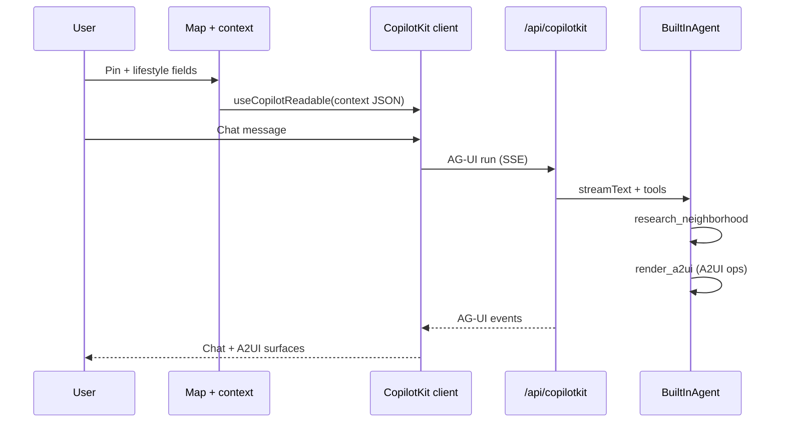

# Architecture (developer overview)

## Product shape (hackathon)

The **agent is the frontend** for place evaluation: after a map pin and user context, the model decides which **A2UI** surfaces to emit (commute, food, rent, risk, comparison, clarification forms, etc.). The client does **not** ship a fixed tabbed dashboard for results.

Stable client chrome (by design):

1. **Map** — pin drop / coordinates.
2. **Lifestyle context** — work location, schedule, transport, budget, food importance.
3. **Agent canvas** — `CopilotChat`; A2UI renders inside the message stream when the runtime enables A2UI.
4. **Personal moving checklist** — localStorage todo list (user-requested addon); separate from agent-generated analysis UI.

## Stack mapping

| Layer | Technology |
|-------|------------|
| App shell | Next.js App Router, React 19, TypeScript, Tailwind |
| Agent host & chat | CopilotKit (`@copilotkit/react-core`, `@copilotkit/react-ui`) |
| Transport / run loop | AG-UI (events between client and Copilot runtime) |
| Declarative UI | A2UI — `render_a2ui` tool + `@copilotkit/a2ui-renderer` |
| LLM | `BuiltInAgent` + Vercel AI SDK; default Google Gemini via `LLM_MODEL` |
| Runtime endpoint | `app/api/copilotkit/route.ts` → `copilotRuntimeNextJSAppRouterEndpoint` |

## Request flow (simplified)

## Key source files

| Path | Role |
|------|------|
| `app/api/copilotkit/route.ts` | `CopilotRuntime`, `BuiltInAgent`, `a2ui: { injectA2UITool: true }`, research tool |
| `lib/agent/prompts.ts` | System prompt — forces A2UI-first behavior |
| `lib/research/mock-research.ts` | Replace with real APIs / web research |
| `lib/llm-config.ts` | `LLM_MODEL` / `GEMINI_MODEL` + `GOOGLE_API_KEY` for Gemini |
| `components/home-page.tsx` | Layout; `useCopilotReadable` wires context |
| `components/map-pin-picker.tsx` | Google Maps pin |
| `components/moving-todo-panel.tsx` | Local todo list (not agent UI) |

## Swapping the LLM

All model selection goes through environment variables documented in [API_KEYS.md](./API_KEYS.md). No code edit is required for a new Gemini ID or many other providers supported by `BuiltInAgent`.

## Replacing mock research

Edit `lib/research/mock-research.ts` or change the `defineTool` execute handler in `app/api/copilotkit/route.ts` to call:

- Places / geocoding APIs
- Transit APIs
- Rental listing aggregators
- Custom scrapers (respect robots + ToS)

Keep the tool output **structured JSON** so the agent can map it into A2UI data models.
